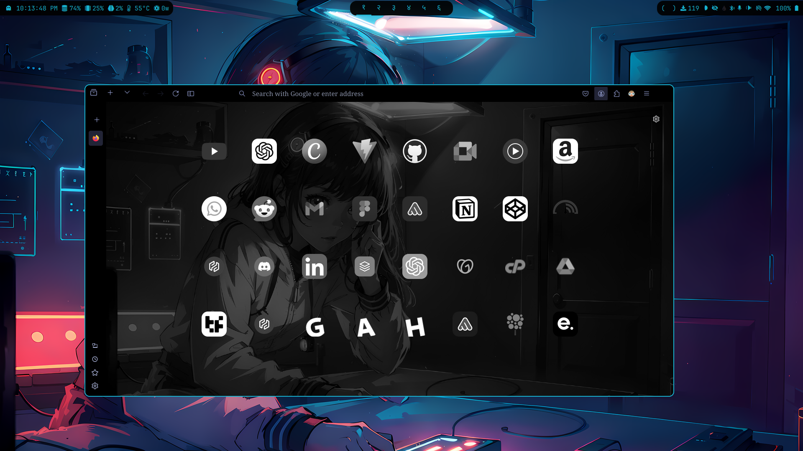

# Minimal Aesthetic Firefox CSS

A lightweight and minimalist CSS theme for Firefox that enhances aesthetics without compromising performance. This CSS aims to provide a sleek, distraction-free browsing experience while keeping customization options for those who enjoy personalizing their interface.

## Preview

<div align="center" width="100%">  </div>

## Installation Guide

To install this custom CSS theme in Firefox, follow these steps:

1. **Enable Custom CSS in Firefox**
   - Type `about:config` in your URL bar and press Enter.
   - If prompted, click **I accept the risk**.
   - Search for `toolkit.legacyUserProfileCustomizations.stylesheets` and set it to **true**.

2. **Enable Sidebar/Vertical Tabs**
   - In `about:config`, search for `sidebar.verticalTab` and set it to **true**.
   - Then, search for `sidebar.revamp` and set it to **true**.

3. **Locate Your Firefox Profile Folder**
   - Linux: `$HOME/.mozilla/firefox/######.default-release/`
   - MacOS: `Users/[USERNAME]/Library/Application Support/Firefox/Profiles/######.default-release`
   - Windows: `C:\Users\[USERNAME]\AppData\Roaming\Mozilla\Firefox\Profiles\######.default-release`

4. **Copy Files to Your Profile**
   - Copy the `chrome` folder (containing `userChrome.css` and any other necessary CSS files) into your Firefox profile folder.
   - Restart Firefox to apply the CSS theme.

5. **Customize to Your Liking** *(optional)*
   - Open the CSS files in the `chrome` folder and modify the styles to suit your preferences.

<details> <summary><strong>How to Set a Wallpaper/Background Image in Firefox</strong></summary>


To have the wallpaper/background image display correctly in Firefox, follow these steps:
Ensure your image file is named wallpaper.png and place the image in the following directory:
```
    PROFILE_DIRECTORY/chrome/styles/ASSETS/wallpaper/walpaper.png
```

</details>

---


# Contributions

Thank you for considering contributing to **MiniSthetic_Firefox: Minimalist & Aesthetic Theme for Firefox**! We welcome contributions from anyone who shares our vision of maintaining a clean, functional, and aesthetically pleasing browsing experience.

## How to Contribute

- **Feature Suggestions**: If you have ideas for features that can enhance productivity while adhering to our minimalist and aesthetic philosophy, please share them! We aim to prioritize functionality without compromising the project's core ethos of simplicity.
  
- **Improvements and Bug Fixes**: If you spot any issues or have suggestions for improvements, feel free to submit a pull request. Your contributions help make the theme better for everyone.

## Guidelines

- Keep in mind our motto: **Minimalist & Aesthetic Theme for Firefox**. Focus on adding features that enhance usability and productivity while maintaining a clean and simple design—no unnecessary frills!
  
- Ensure that any contributions align with the overall aesthetic and functionality goals of the project.

Thank you for your support, and we look forward to seeing your contributions!

